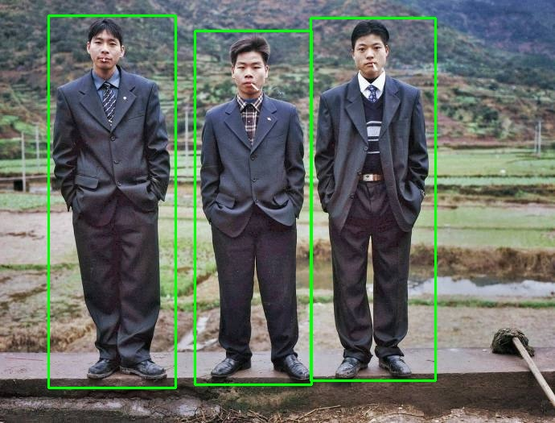
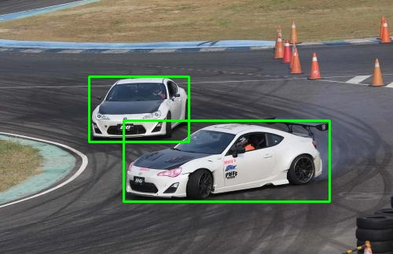
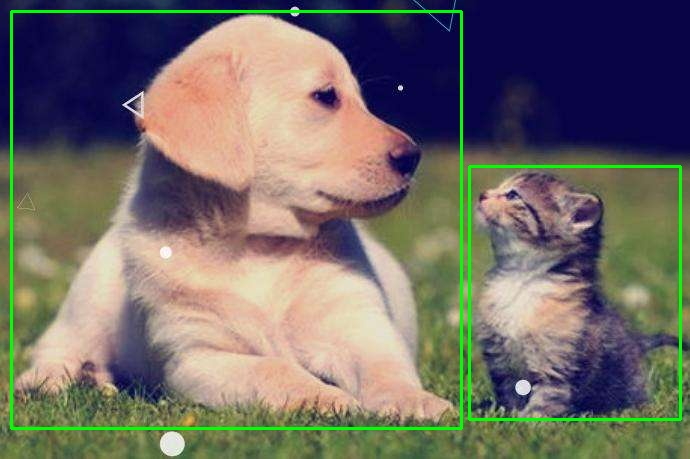

## centerface on nnie

训练代码参考yolov5,此代码所用模型进行了重新训练，代码使用C++ opencv方式编写，简洁易用。

#### 性能

Hi3516cv500:

| --        | --   |
| --------- | ---- |
| 416 * 416 | 40ms |

VOC2007 Test:

| --     | --   |
| ------ | ---- |
| MAP@0.5   | 84   |

#### 结果演示:

##### QQ Group:1164802745

##### Wechat: xzmh321

商务合作联系：tevcam2020@163.com

